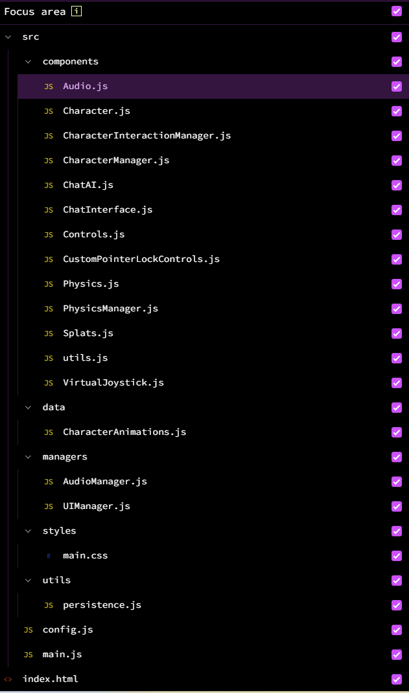

## Marble Test 2 — Interactive Splats Starter

Gaussian Splatting を Three.js + Spark Renderer で描画し、簡易なキャラクター、チャット、物理（Rapier）を備えたインタラクティブなサンプルです。ビルド不要（CDN モジュール）で、静的サーバーからそのまま動かせます。



## 特長

- **Gaussian Splats 描画**: `@sparkjsdev/spark` を使用
- **一人称視点移動**: WASD + マウス、R/F 垂直移動、モバイルはバーチャルジョイスティック
- **物理**: Rapier（CDN 互換）でコリジョン・ダイナミクス
- **スペースキーで弾発射**: カメラ前方へ球体を射出（クールダウン/寿命付き）
- **キャラクター/会話**: 近接で `T` キー会話開始、シンプルな UI
- **オーディオ管理**: ループ/ミュート、UI 連動

## クイックスタート

1) 依存: なし（最新ブラウザ、ローカル HTTP サーバーのみ）

2) サーバ起動（どちらか）

```bash
cd /Users/funakoshiakira/workspace/marble-test-2
python3 -m http.server 5173
# もしくは
npx http-server -p 5173 .
```

3) ブラウザで開く

`http://localhost:5173`

> 注意: `file://` で直接開くと CORS 制限により ES Modules が読み込めず動きません。必ず HTTP 経由で配信してください。

## 操作方法（デスクトップ）

- **開始**: 画面クリックでポインターロック開始
- **移動**: `W/A/S/D`、垂直: `R`（上）/`F`（下）
- **視点**: マウス移動
- **弾発射**: `Space`（0.25 秒クールダウン、前方に球体を射出）
- **会話**: 近接して `T`（チャット UI が開いていない時）
- **UI ショートカット**: 
  - `Ctrl + H` カメラ座標の表示切替
  - `Ctrl + C` カメラ座標をクリップボードにコピー

### 操作方法（モバイル）

- 左下のバーチャルジョイスティックで移動、画面ドラッグで視点
- 上/下ボタンで垂直移動

## 主要ファイル

- `index.html`: Import Map と Canvas、UI の土台
- `src/main.js`: シーン/レンダラ初期化、各マネージャの結線、ループ
- `src/config.js`: アセット URL、チューニング値、物理設定
- `src/components/Controls.js`: 一人称移動、入力（`consumeJump()` で Space 消費）
- `src/components/Physics.js`: Rapier 初期化、静的メッシュ登録ヘルパー
- `src/components/PhysicsManager.js`: 物理ループ、プレイヤー KCC、弾（球体）の生成・更新
- `src/components/CharacterManager.js`: キャラクター生成/更新
- `src/components/CharacterInteractionManager.js`: 近接検知、`T` で会話開始
- `src/components/ChatInterface.js`: チャット UI（Enter 送信、Shift+Enter 改行、Esc クローズ）
- `src/managers/UIManager.js`: UI 状態、ミュート、ポインターロック制御、ショートカット

## 弾（球体）発射の仕様

- 発射: ループ内で `controls.consumeJump()` が true のときに実行
- 生成: `PhysicsManager.spawnBallFromCamera(camera, controls, options)`
  - `speed` デフォルト 22、`radius` 0.12、`ttl` 6.0 秒、`offset` 0.8m、`color` `0xffaa00`
- 物理: Rapier 動的剛体 + 球コライダー、反発/摩擦あり
- レンダリング: `THREE.SphereGeometry` + `MeshStandardMaterial`
- クリーンアップ: TTL 経過 or 画面外で自動削除（剛体破棄・リソース解放）

## 設定（`src/config.js`）

- **スプラット**: `CONFIG.SPLAT.URL` に `.spz` の URL を指定
- **スケール/位置/回転**: `SCALE` / `POSITION` / `ROTATION_EULER`
- **環境コリジョン**: `ENV.GLB_URL` に GLB を指定すると静的トライメッシュとして衝突を付与
- **物理**: `PHYSICS` セクションで重力、固定ステップ、KCC パラメータなどを調整
- **移動速度**: `MOVE_SPEED`

## よくある質問 / トラブルシュート

- 何も表示されない / CORS エラーが出る
  - `file://` で開いていませんか？ローカル HTTP サーバで `http://localhost:5173` を使用してください。

- クリックしても動かない
  - 最初に画面をクリックしてポインターロック（カーソルが隠れる）を有効化してください。

- スペースで弾が出ない
  - チャット入力中やテキスト入力中はブロックされます（`consumeJump()` で制御）。チャットを閉じてから試してください。

- フレームレートが低い
  - `CONFIG.SPARK` のチューニングや `renderer.setPixelRatio` の上限（`DPR_MAX`）を調整してください。

## カスタマイズのヒント

- キャラクター追加: `src/components/CharacterManager.js` の `registerCharactersForLevel` にエントリを追加
- 会話/インタラクション: `CharacterInteractionManager` と `ChatInterface` を拡張
- 弾の見た目/挙動: `PhysicsManager.spawnBallFromCamera` のオプション/マテリアル/反発値を変更
- 環境コリジョン: GLB を `ENV.GLB_URL` に指定し、`addStaticTrimesh` が自動登録します

## ライセンス

このリポジトリのライセンスは未指定です。利用条件が必要な場合は追記してください。


